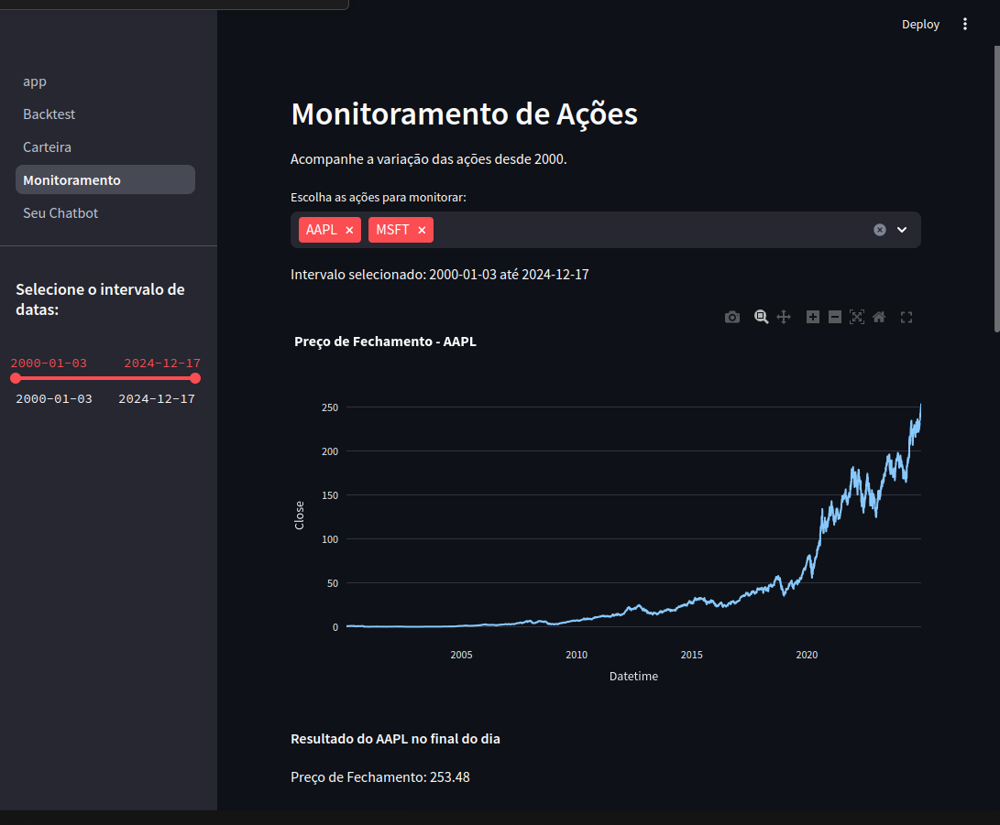
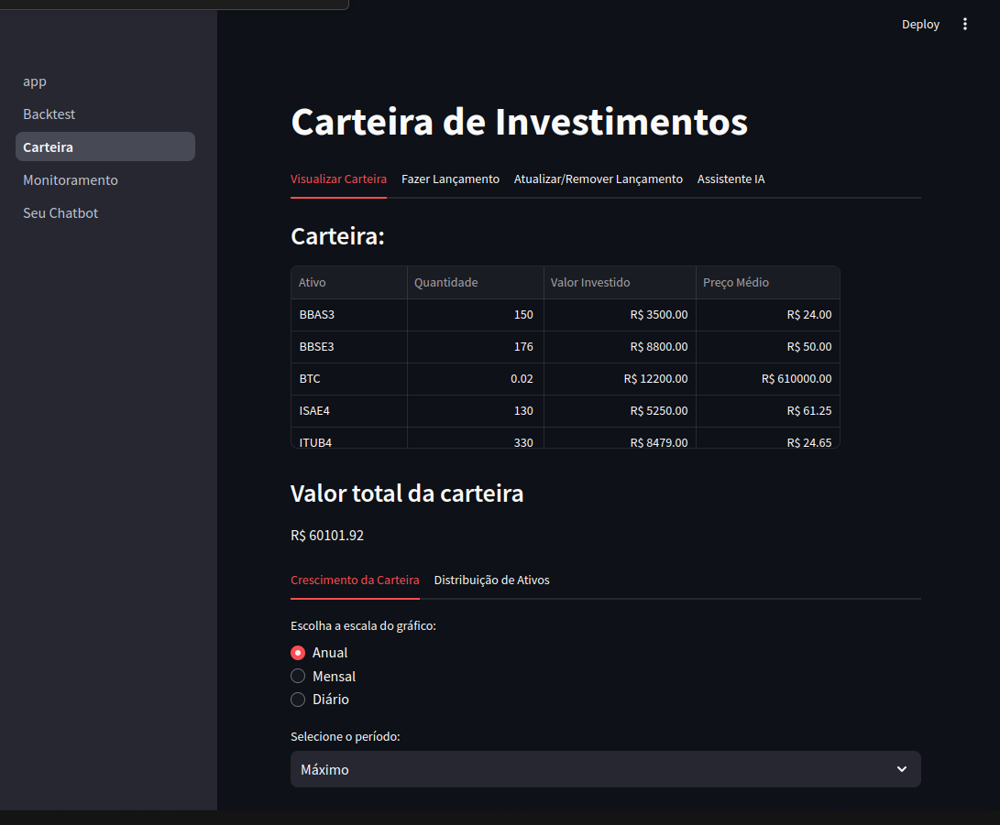
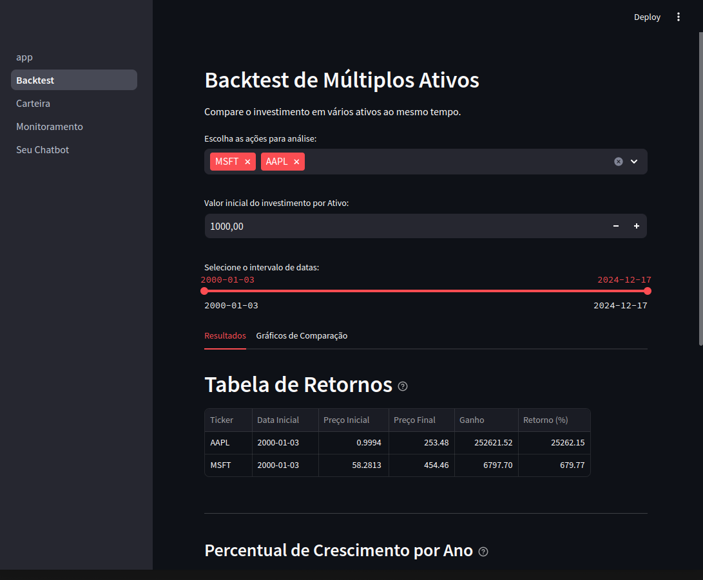

# 📊 Monitoramento de Ações e Backtest

Este projeto fornece um **dashboard interativo** para monitorar o desempenho de ações, gerenciar carteiras de investimentos e realizar backtests de múltiplos ativos ao longo do tempo.

##  Funcionalidades

### 1. **Monitoramento de Ações**
- Acompanhe o preço de fechamento das ações ao longo de um período específico.
- Selecione ações individuais para análise e visualize gráficos de desempenho.
- Intervalo de datas configurável entre 2000 e 2024.

### 2. **Carteira de Investimentos**
- Visualize sua carteira com dados de:
  - Ativos, Quantidade, Valor Investido e Preço Médio.
- **Cálculo do Valor Total da Carteira**.
- Gráficos de Crescimento e Distribuição de Ativos:
  - Escalas disponíveis: Anual, Mensal e Diário.

### 3. **Backtest de Múltiplos Ativos**
- Compare o desempenho de múltiplos ativos (ex: MSFT e AAPL).
- Configure:
  - **Valor Inicial do Investimento**.
  - **Intervalo de Datas** (2000-2024).
- Visualize:
  - Tabela de Retornos: Preço Inicial, Final, Ganho e Retorno (%).
  - Percentual de Crescimento por Ano.

##  Capturas de Tela

### Monitoramento de Ações

### Carteira de Investimentos

### Backtest de Ativos

##  Tecnologias Utilizadas
- **Python**
- **Streamlit** (para o dashboard)
- **Pandas** (manipulação de dados)
- **Plotly** (visualização de gráficos)

